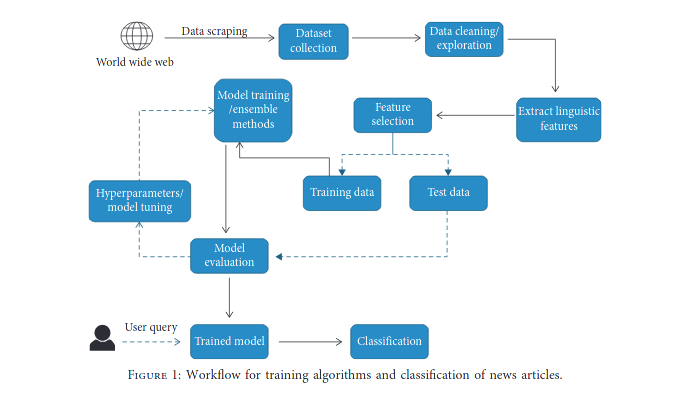

# Fake news detection - Romanian

* ###   Motivation
  * Because of the rapid increase in popularity of social media platforms in the recent years, misinformation
delivered in the form of fake news has grown to be a very big problem in today's society. Over 70% of the news
consumed today are via Facebook/Twitter and the regulatory just can't live up to the severity of the phenomenon.
  * The fake news phenomenon affects a big number of domains, ranging from  sports to health, science or
even economy.
  * In the age of information, our view about the world is mostly afected by the media we consume.

* ### Methods to counteract the problem
  * Manual checking of articles by human elements
    * There are a lot of fake/shady websites repositories
    * Time/cost inefficient in relation to the amounts of data on the social media sites
  * Convolutional neural networks (CNN) trained to recognize and discard fake data
    * Very time efficient
    * Very fast detection
    * Hard to develop
    * Hard to maintain

* ### Tools/materials used in the field
   Being that this field is still in actively development, there is still a lot of experimenting going on
right now. Some of the proposed methods include:
  * Using Machine Language (ML) classifiers along with Natural Language Processing (NLP) engines in order to
  categorize keywords/phrases/ideas from a text article.
  * Using data mining algorithms to extract feautures of fake articles in order to better improve the classifiers
  * Using Convolutional Neural Networks (CNN) to capture metadata dependencies that is then used to enhance the
final prediction accuracy.
  * The [Fake News Corpus](https://github.com/several27/FakeNewsCorpus ) , a dataset containing over a million fake articles.
* ### Proposed solution
  * The cited article affirms that, at the moment, the most optimised tools in dectecting fake news achieve an overall accuracy
  of approximatively 88.5%. In order th improve this accuracy, the authors propose a framework that combines
  the existing fake news corpus with Linguistic Inquiry and Word Count (LIWC) feature set, as well as multiple trusted sources (PolitiFact, Snopes)
  for a more accurate fact checking and selects the best algorithm for a given article.

  *  The framework has the following structure :
  

  *  The model will use the following ML algorithms :
     * Support Vector Machine
     * Ensemble Learners:
       * Random forest
     * Benchmark Algorithms:
       * Linear SVM
       * CNN
  * To evaluate the performance of the solution, the accuracy is determinated in multiple ways, such as
      * Accuracy
      * Recall

* ### Bibliography
    * [The role of user profiles for fake news detection](https://dl.acm.org/doi/abs/10.1145/3341161.3342927)
    * [Development of Fake News Model Using Machine Learning through Natural Language Processing](https://publications.waset.org/10011624/development-of-fake-news-model-using-machine-learning-through-natural-language-processing)
    * [CSI: A Hybrid Deep Model for Fake News Detection](https://dl.acm.org/doi/abs/10.1145/3132847.3132877)
    * [Fake News Detection Using Machine Learning Ensemble Methods](https://www.hindawi.com/journals/complexity/2020/8885861/)
